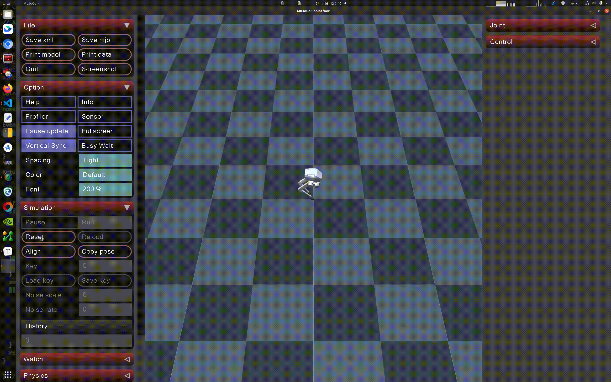

# 英文 | [中文](README.md)
# rl-deploy-with-python

## 1. Running the Simulation

- Open a Bash terminal.

- Clone the MuJoCo simulator code:

  ```bash
  git clone --recurse https://github.com/limxdynamics/pointfoot-mujoco-sim.git
  ```

- Install the motion control development library (if not already installed):

  - For Linux x86_64 environment:

    ```bash
    pip install pointfoot-mujoco-sim/limxsdk-lowlevel/python3/amd64/limxsdk-*-py3-none-any.whl
    ```

  - For Linux aarch64 environment:

    ```bash
    pip install pointfoot-mujoco-sim/limxsdk-lowlevel/python3/aarch64/limxsdk-*-py3-none-any.whl
    ```

- Set the robot type:

  - List the available robot types using the Shell command:

    ```bash
    tree -L 1 pointfoot-mujoco-sim/robot-description/pointfoot
    ```

    Example output:

    ```plaintext
    pointfoot-mujoco-sim/robot-description/pointfoot
    ├── PF_P441A
    ├── PF_P441B
    ├── PF_P441C
    └── PF_P441C2
    ```

  - Set the robot model type (using `PF_P441C` as an example; replace with your actual robot type):

    ```bash
    echo 'export ROBOT_TYPE=PF_P441C' >> ~/.bashrc && source ~/.bashrc
    ```

- Run the MuJoCo simulator:

  ```bash
  python pointfoot-mujoco-sim/simulator.py
  ```

## 2. Running the Control Algorithm

- Open a Bash terminal.

- Clone the control algorithm code:

  ```bash
  git clone --recurse https://github.com/limxdynamics/rl-deploy-with-python.git
  ```

- Install the motion control development library (if not already installed):

  - For Linux x86_64 environment:

    ```bash
    pip install rl-deploy-with-python/limxsdk-lowlevel/python3/amd64/limxsdk-*-py3-none-any.whl
    ```

  - For Linux aarch64 environment:

    ```bash
    pip install rl-deploy-with-python/limxsdk-lowlevel/python3/aarch64/limxsdk-*-py3-none-any.whl
    ```

- Set the robot type:

  - List the available robot types using the Shell command:

    ```bash
    tree -L 1 rl-deploy-with-python/controllers/model
    ```

    Example output:

    ```plaintext
    rl-deploy-with-python/controllers/model
    ├── PF_P441A
    ├── PF_P441B
    ├── PF_P441C
    ├── PF_P441C2
    ├── PF_TRON1A
    ├── SF_TRON1A
    └── WF_TRON1A
    ```

  - Set the robot model type (using `PF_P441C` as an example; replace with your actual robot type):

    ```bash
    echo 'export ROBOT_TYPE=PF_P441C' >> ~/.bashrc && source ~/.bashrc
    ```

- Run the control algorithm:

  ```bash
  python rl-deploy-with-python/main.py
  ```

## 3. Virtual Joystick

- Open a Bash terminal.

- Run the robot-joystick:

  ```bash
  ./pointfoot-mujoco-sim/robot-joystick/robot-joystick
  ```

## 4. Demonstration of Results

